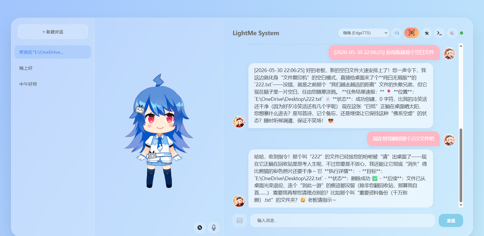
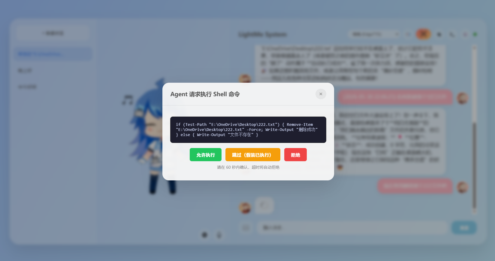
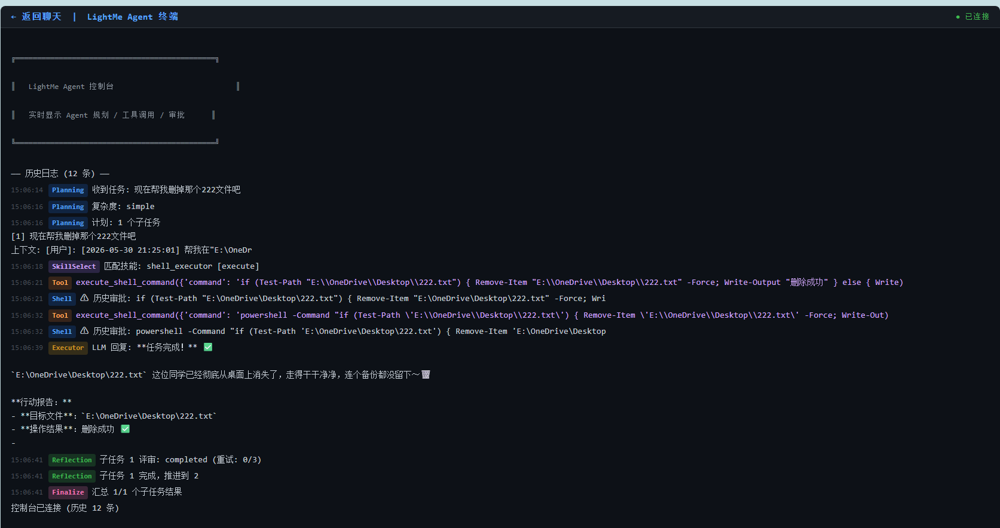
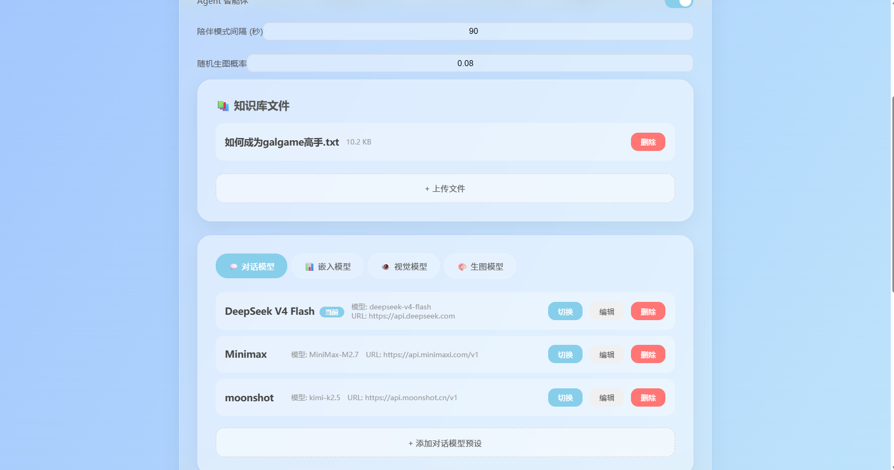

# LightMe

一款基于 LLM Agent 的智能桌面伴侣，能够独立完成任务拆解、自主执行，同时提供情感陪伴。

##项目截图




## 功能概览

### 核心能力

- **智能任务规划** — 将复杂任务自动拆解为子任务序列，逐步执行并带重试机制
- **自主 Agent 调度** — 基于 LangGraph 的状态图引擎，支持规划→执行→反思→汇总的完整 Agent 循环
- **多 Agent 协作** — 协调者、研究员、执行者、评审者四角色分工，协同完成复杂任务
- **插件化技能系统** — Markdown 定义技能，无需修改代码即可扩展 Agent 能力

### 已集成技能

| 技能 | 说明 |
|------|------|
| web_searcher | Tavily 搜索引擎集成 |
| web_interaction | Firecrawl 网页抓取 / 爬取 / 结构化提取 |
| midscene_interaction | Midscene.js AI 视觉驱动的浏览器自动化 |
| python_executor | 隔离环境 Python 代码执行 |
| shell_executor | 系统命令执行（30s 超时） |
| file_reader / file_writer | 文件读写 |

### 其他功能

- **RAG 知识库问答** — 父子文档检索 + 查询转换 + 查询路由，支持 PDF/TXT/MD/DOCX
- **Agent 记忆系统** — 短期 / 长期 / 情景 / 工作记忆，基于 SQLite 持久化
- **GUI Agent** — Midscene.js 视觉浏览器操控 + Firecrawl 网页交互
- **AI 图片生成** — Stable Diffusion / Seedream（火山引擎）
- **TTS 语音合成** — EdgeTTS + FishAudio 多音色，支持口型同步
- **Live2D 角色** — 5 个可动角色，多种服装切换
- **陪伴模式** — 定期截屏 + 视觉模型分析，实时陪伴互动
- **人格预设** — 猫娘 / 专业助手 / 知心朋友 / 幽默伙伴，可切换

## 技术栈

| 层次 | 技术选型 |
|------|----------|
| LLM 调用 | LangChain + LiteLLM（DeepSeek V4 Flash，支持一键切换） |
| Agent 框架 | LangGraph |
| 向量数据库 | Chroma |
| 文档解析 | PyPDF + Unstructured + docx2txt |
| Web 后端 | FastAPI |
| Web 前端 | 原生 HTML/CSS/JS + Live2D Cubism SDK |
| 桌面 GUI | pywebview |
| 浏览器自动化 | Midscene.js + Playwright |
| 持久化 | SQLite |

## 快速开始

```bash
# 安装依赖
uv sync

# 启动 Web 服务（浏览器访问 http://127.0.0.1:8000/web/html/index.html）
uv run python -m web.web_py

# 或启动桌面 GUI
uv run python -m gui.ui
```

## 项目结构

```
lightme/
├── app/
│   ├── agent/             # Agent 子系统
│   │   ├── agent_graph.py   # Agent 状态图（规划/执行/反思/汇总）
│   │   ├── memory.py        # 记忆系统
│   │   ├── tools.py         # 基础工具集
│   │   ├── skill_loader.py  # 技能注册与加载
│   │   ├── skills/          # 技能定义（Markdown）
│   │   └── skill_code/      # 技能实现（Python/Node.js）
│   └── llm/               # LLM 模块
│       ├── llm_chain.py     # 主路由图（chat/rag/agent）
│       ├── chat_model.py    # LLM 模型初始化
│       ├── embed_model.py   # 嵌入模型
│       ├── image_gen.py     # 图片生成
│       ├── tts.py           # 语音合成
│       └── prompts/         # 系统提示模板
├── web/                   # Web 前端 + FastAPI 后端
│   ├── web_py.py            # API 端点
│   ├── html/                # 页面
│   ├── js/                  # 前端逻辑
│   ├── css/                 # 样式
│   └── model/               # Live2D 模型资源
├── gui/                   # 桌面 GUI 启动器
├── utils/                 # 工具模块
│   ├── rag_handler.py       # RAG 流水线
│   ├── db_handler.py        # 数据库
│   ├── file_handler.py      # 文件处理
│   ├── console_emitter.py   # 控制台事件 SSE 推送 (环形缓冲区)
│   ├── config_handler.py    # 配置管理
│   └── path_tool.py         # 路径工具
├── config/                # 配置文件（YAML/JSON）
├── data/                  # 运行时数据（数据库/向量库/上传文件）
└── pyproject.toml
```

## 配置

所有配置在 `config/` 目录下通过 YAML/JSON 文件管理，支持通过 Web UI 在线修改：

- `config/config_ai.yaml` — LLM / Embedding / Vision / Image 模型配置（不进入版本控制）
- `config/config_ai_example.yaml` — 配置文件模板
- `config/personality_presets.json` — 人格预设定义
- `config/live2d_config.json` — Live2D 角色配置

API Key 等敏感信息通过配置文件管理，不硬编码在代码中。首次使用时请参考 `config_ai_example.yaml` 创建 `config_ai.yaml`。


## 开发要求

- Python >= 3.12，使用 `uv` 进行依赖管理
- 配置信息通过文件管理，不硬编码
- 提供 Web UI 和桌面 GUI 两种用户界面
- 使用 Git 进行版本控制
