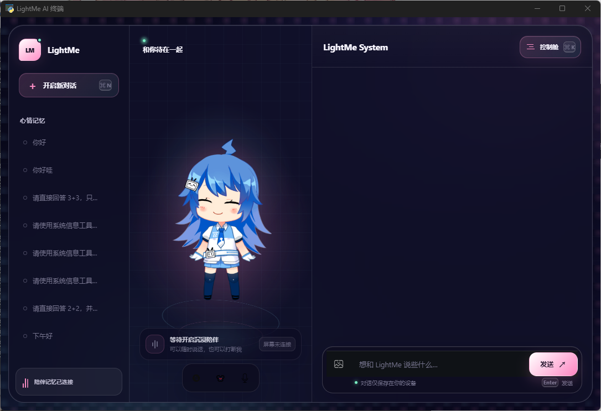
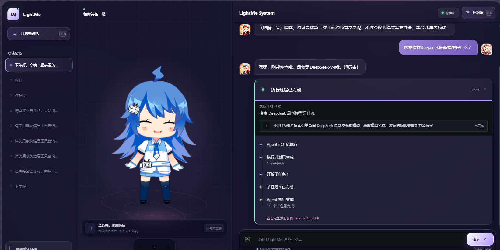
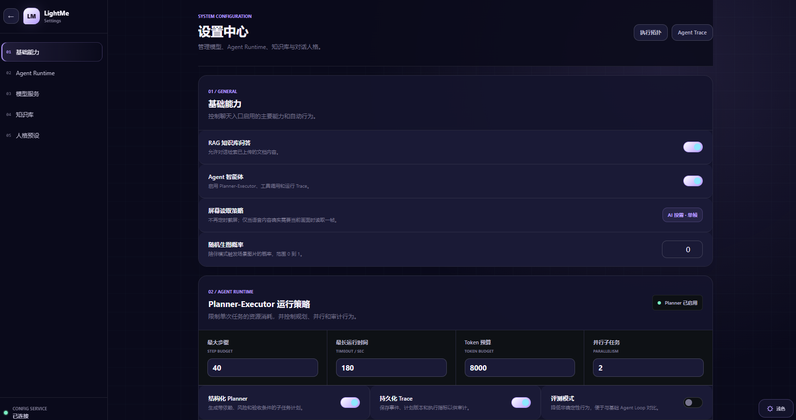
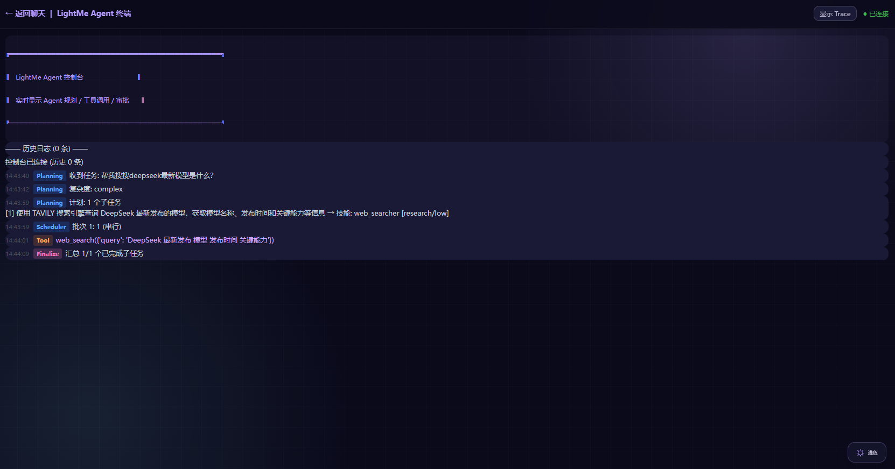
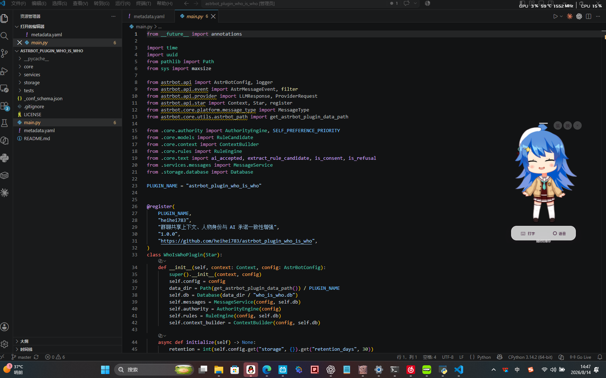
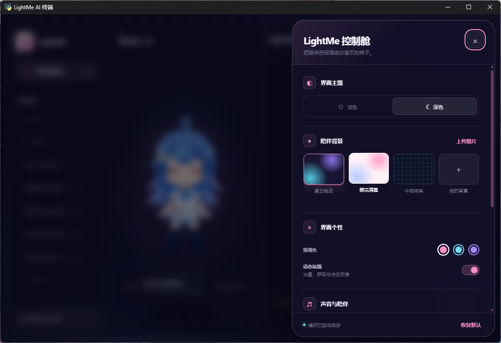
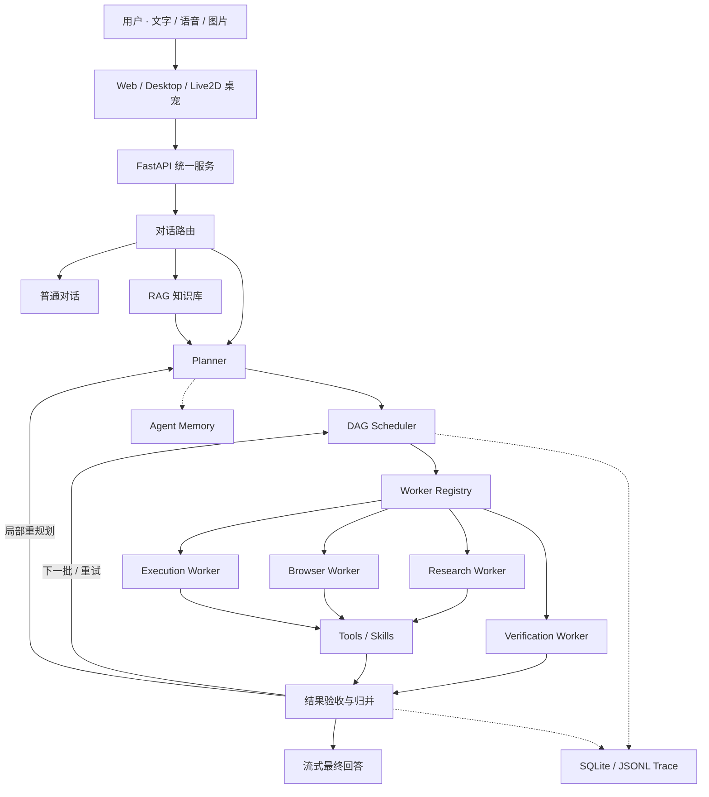

# LightMe

> 会陪伴、能规划、可执行、可追踪的 Live2D 智能桌面 Agent。

<p align="center">
  
</p>

<p align="center">
  <a href="#项目简介">项目简介</a> ·
  <a href="#界面预览">界面预览</a> ·
  <a href="#快速开始">快速开始</a> ·
  <a href="#系统架构">系统架构</a> ·
  <a href="#核心实现说明">实现说明</a> ·
  <a href="#配置说明">配置说明</a>
</p>

<p align="center">
  
  
  
  
  
</p>

## 项目简介

LightMe 是一个将 **Live2D 桌面陪伴** 与 **可靠 AI Agent** 融合在一起的本地智能助手。

你可以像使用聊天助手一样与角色进行文字或语音交流，也可以把搜索、资料整理、文件处理、代码运行和网页操作等复杂目标交给 Agent。LightMe 会先生成结构化计划，再由 Scheduler 调度不同能力的 Worker 执行，并在界面中展示任务进度、工具调用、执行证据和最终结果。

它同时提供知识库问答、跨轮记忆、人格与模型预设、可打断语音、AI 按需看屏幕、桌面悬浮角色和结构化 Trace，让“陪伴感”与“任务完成能力”出现在同一个应用中。

## 为什么是 LightMe

- **不止聊天**：支持模型与工具的多轮交互，能够真正执行搜索、文件、Python、Shell 和浏览器任务。
- **先规划再行动**：Planner 生成带依赖关系和验收条件的子任务，Scheduler 按 DAG 就绪状态进行安全调度。
- **过程看得见**：聊天页展示 Agent 执行卡片，终端页输出实时事件，执行拓扑和 Trace 可用于回放与审计。
- **失败可恢复**：对子任务结果进行验证，支持有限重试、失败分支处理与局部重规划。
- **陪伴不中断**：支持持续语音、用户开口打断、TTS 播放和 Live2D 口型联动。
- **隐私更克制**：屏幕共享与截图分离；只有对话确实需要当前画面时，才从已授权的屏幕通道读取一帧。
- **体验可定制**：可切换角色、人格、模型、音色、主题、强调色、陪伴背景与动态效果。

## 界面预览

### 对话与 Agent 执行

| 主界面 | Agent 执行过程 |
| --- | --- |
|  |  |

主界面将会话记忆、Live2D 角色和聊天工作区组合在一起。复杂任务执行时，右侧会显示计划、子任务状态、耗时和完整执行拓扑入口。

### 配置与运行观测

| 设置中心 | Agent 终端与 Trace |
| --- | --- |
|  |  |

设置中心统一管理基础能力、Agent Runtime、模型服务、知识库与人格预设；终端页实时显示 Planning、Scheduler、Tool 和 Finalize 等事件。

### 桌面陪伴与个性化

| 桌宠模式 | 控制舱 |
| --- | --- |
|  |  |

桌宠可以悬浮在其他应用上方，并提供打字与语音入口。控制舱支持浅色/深色主题、陪伴背景、强调色、动态效果、声音和角色相关设置。

## 核心能力

| 模块 | 主要能力 |
| --- | --- |
| 对话与陪伴 | 流式对话、会话历史、人格预设、TTS、Live2D 动作与口型同步 |
| Planner–Scheduler–Worker | 结构化计划、DAG 调度、Worker 能力隔离、安全并行、结果验收、重试与局部重规划 |
| Agent Runtime | 步数、运行时间、Token 与工具调用预算，重复调用检测，Shell 审批 |
| Memory | 工作记忆、长期记忆与情景记忆，跨轮任务续接、召回去重与敏感信息脱敏 |
| RAG 知识库 | 文件上传与管理、父子文档检索、查询转换，支持 PDF、TXT、Markdown 和 DOCX |
| 工具与 Skills | Web 搜索、网页抓取、浏览器自动化、Python、Shell、文件读写和系统操作 |
| 语音与视觉 | 持续语音识别、打断旧回复、可取消 TTS、图片理解、AI 按需截取一帧屏幕 |
| 可观测性 | 聊天执行卡片、实时终端日志、执行拓扑、计划版本和结构化 Agent Trace |
| 多端形态 | Web 浏览器、桌面窗口、纯后端服务和悬浮桌宠 |

## 系统架构



### Agent 的一次执行

1. Router 判断请求应进入普通聊天、RAG 还是 Agent。
2. Planner 将目标转换为包含依赖、风险、工具范围、预算和验收条件的结构化子任务。
3. Scheduler 选择当前可执行的任务；低风险读取任务可以并行，有副作用的任务保持受控执行。
4. Worker 在最小工具白名单内完成任务并返回结果、证据和产物。
5. Verifier 检查结果；不通过时触发重试、跳过受阻分支或局部重规划。
6. 系统汇总结果，同时保存计划版本、事件、指标和跨轮 Handoff。

## 核心实现说明

以下文档记录了 LightMe 在 Agent 架构、统一 Runtime 和跨轮记忆方面的主要设计与实现细节：

| 文档 | 内容说明 |
| --- | --- |
| [智能体架构说明](智能体架构说明.md) | 介绍 Planner-Executor 多智能体架构，包括结构化计划、DAG 调度、Worker 分工、工具权限、结果验收、失败重试与局部重规划。 |
| [合并的 Runtime 说明](合并的runtime说明.md) | 说明统一 Agent Runtime 的合并方案，包括运行主路径、状态管理、预算控制、Trace、异常处理和旧入口兼容。 |
| [Agent 记忆说明](agent记忆说明.md) | 介绍工作记忆、长期记忆和情景记忆，以及记忆写入、检索、去重、用户隔离和跨轮任务续接。 |

## 快速开始

### 1. 环境要求

- Python `3.12` 或 `3.13`
- [uv](https://docs.astral.sh/uv/) 包管理器
- Windows 10/11（桌面窗口、桌宠和原生语音体验推荐）
- 最新版 Chrome / Edge（Web 端持续语音与屏幕共享推荐）
- Node.js（仅浏览器自动化 / Midscene 能力需要）

### 2. 获取项目并安装依赖

```bash
git clone https://github.com/heihei783/lightme.git
cd lightme
uv sync
```

`uv sync` 会依据 `pyproject.toml` 和 `uv.lock` 创建虚拟环境并安装依赖。

### 3. 创建配置文件

Windows PowerShell：

```powershell
Copy-Item config/config_ai_example.yaml config/config_ai.yaml
```

macOS / Linux：

```bash
cp config/config_ai_example.yaml config/config_ai.yaml
```

至少填写一个可用的对话模型：

```yaml
CHAT_MODEL_NAME: your-model-name
CHAT_MODEL_PROVIDER: your-provider
CHAT_MODEL_API_KEY: your-api-key
CHAT_MODEL_URL: https://your-api-endpoint/v1
```

> [!IMPORTANT]
> 请根据模型服务商的文档填写 Provider 和接口地址。`config/config_ai.yaml` 包含密钥，请勿提交到版本库。

### 4. 启动 LightMe

桌面窗口模式（默认）：

```bash
uv run python main.py
```

Web 模式：

```bash
uv run python main.py --web
```

仅启动后端：

```bash
uv run python main.py --server
```

自定义监听地址和端口：

```bash
uv run python main.py --server --host 0.0.0.0 --port 9000
```

默认地址：

- LightMe：<http://127.0.0.1:8000/web/html/index.html>
- API 文档：<http://127.0.0.1:8000/docs>

Windows 用户完成依赖安装和配置后，也可以运行 `start_web.bat` 或 `start_desktop.bat`。

## 第一次使用

1. 在聊天框发送一条普通消息，确认对话模型配置有效。
2. 尝试“搜索某个主题并整理要点”之类的任务，观察 Agent 执行卡片。
3. 从设置中心配置 Embedding、视觉、图片生成、TTS、Tavily 或 Firecrawl 等可选服务。
4. 上传资料到知识库，开启 RAG 后进行文档问答。
5. 打开 Agent Trace 或执行拓扑，查看计划、调度、工具调用和验收过程。
6. 在控制舱中调整主题、背景、声音和角色，或切换到桌宠模式。

## 配置说明

主要配置文件为 `config/config_ai.yaml`，多数选项也可以在设置中心管理。

| 配置组 | 关键字段 | 用途 |
| --- | --- | --- |
| Chat | `CHAT_MODEL_*` | 主对话与 Agent 使用的模型 |
| Embedding | `EMBEDDING_MODEL_*` | RAG 文档向量化与检索 |
| Vision | `VISION_MODEL_*` | 图片理解与按需屏幕分析 |
| Image | `IMAGE_GEN_MODEL_*` | AI 图片生成 |
| TTS | `TTS_MODEL_*` | EdgeTTS / FishAudio 语音合成 |
| Search | `TAVILY_API_KEY` | 联网搜索 |
| Crawl | `FIRECRAWL_API_KEY` | 网页抓取与结构化提取 |
| Runtime | `agent_max_steps`、`agent_max_runtime_seconds`、`agent_max_tokens` | 单次 Agent 运行预算 |
| Planner | `planner_enabled`、`planner_parallelism` | 结构化规划与并发上限 |
| Safety | `shell_require_approval`、`shell_approval_timeout` | Shell 人工审批策略 |
| Trace | `trace_enabled` | 保存执行事件、计划版本与指标 |

基础聊天只需要 Chat 配置。Embedding、视觉、图片生成、搜索、网页抓取和 FishAudio 都是可选能力，可以按需补充。

## 内置工具与 Skills

| Skill | 用途 |
| --- | --- |
| `web_searcher` | 使用 Tavily 进行联网搜索 |
| `web_interaction` | 使用 Firecrawl 抓取、映射和提取网页内容 |
| `midscene_interaction` | 使用 Midscene / Playwright 进行浏览器交互 |
| `python_executor` | 执行 Python 代码 |
| `shell_executor` | 在风险检查、超时和可选审批下执行命令 |
| `file_reader` / `file_writer` | 读取与写入文件 |
| `system_operator` | 结构化系统观察与受控操作 |

Skill 通过 Markdown 描述并在运行时注册。项目也兼容 `.claude/skills/*/SKILL.md`，便于在不修改 Agent 主流程的情况下扩展能力。

## 项目结构

```text
lightme/
├── app/
│   ├── agent/                 # Agent 图、Runtime、Worker、Memory、Tools 与 Skills
│   └── llm/                   # Chat、Embedding、Vision、Image、TTS
├── config/                    # 模型、人格和运行配置
├── data/
│   ├── eval/                  # Agent 评测任务
│   └── images/项目截图/       # README 界面截图
├── gui/                       # 桌面窗口和桌宠入口
├── scripts/                   # Agent 评测脚本
├── tests/                     # Runtime、Memory、Worker、API 等测试
├── utils/                     # RAG、数据库、配置和文件工具
├── web/
│   ├── html/                  # 聊天、设置、终端、拓扑和桌宠页面
│   ├── css/                   # 页面样式
│   ├── js/                    # 交互、Live2D、语音和 Trace 展示
│   ├── model/                 # Live2D 模型资源
│   └── web_py.py              # FastAPI 服务与 API
├── main.py                    # Desktop / Web / Server 统一启动入口
├── pyproject.toml
└── uv.lock
```

## 测试与评测

运行测试：

```bash
uv run --with pytest python -m pytest -q
```

查看 Planner 评测任务但不调用真实模型：

```bash
uv run python scripts/run_agent_eval.py --mode planner
```

执行真实 Agent 评测：

```bash
uv run python scripts/run_agent_eval.py --mode planner --execute
```

> [!CAUTION]
> 真实评测会调用已配置的模型或外部服务，可能产生费用；结果也会受到模型版本、网络和本地环境影响。

## 安全与隐私

- API Key 保存在本地配置中，不应硬编码或提交到仓库。
- Shell 支持危险命令检查、执行超时、预算限制和人工审批。
- Worker 使用最小能力与工具白名单；带副作用的任务不会被盲目并行。
- Memory 在写入和注入上下文前会过滤常见密码、Token、Cookie 与私钥格式。
- 屏幕能力必须先由用户授权；系统不定时截屏，仅在当前问题确实需要画面时读取一帧。
- Trace 保存可审计的事件、计划、工具与结果，不用于展示模型的私密逐字推理。

## 当前限制

- 持续语音和屏幕共享依赖浏览器或 WebView 能力，推荐使用最新版 Chrome / Edge。
- 桌面和原生语音相关依赖主要面向 Windows；其他平台更推荐使用 Web 或 Server 模式。
- Midscene、Tavily、Firecrawl、图片生成和部分 TTS 能力需要额外环境或第三方服务。
- 轻量中文 Memory 召回更适合本地个人场景，复杂同义改写和多租户隔离仍有提升空间。
- 真实 Agent 表现取决于所选模型、提示词、预算、网络和工具服务质量。

## Roadmap

- [ ] 完善跨平台安装与 Docker 部署
- [ ] 增加独立 baseline 与可复现的 Agent 对照评测
- [ ] 引入本地流式 ASR、VAD 和低延迟流式 TTS
- [ ] 增加截图敏感区域识别与自动遮挡
- [ ] 加强 Memory 的向量 / 混合召回与评测指标
- [ ] 完善 CI、端到端测试和插件化工具生态

## 贡献

欢迎提交 Issue 或 Pull Request。提交代码前请：

1. 确认配置文件和 API Key 未进入版本控制；
2. 为 Runtime、Worker、Memory 或 API 行为变更补充测试；
3. 在 PR 中说明变更目的、验证方式与兼容性影响。

## License

本项目基于 [Apache License 2.0](LICENSE) 开源。

---

如果 LightMe 对你有帮助，欢迎 Star，也欢迎一起探索更可靠、更透明、更有温度的个人 AI Agent。
