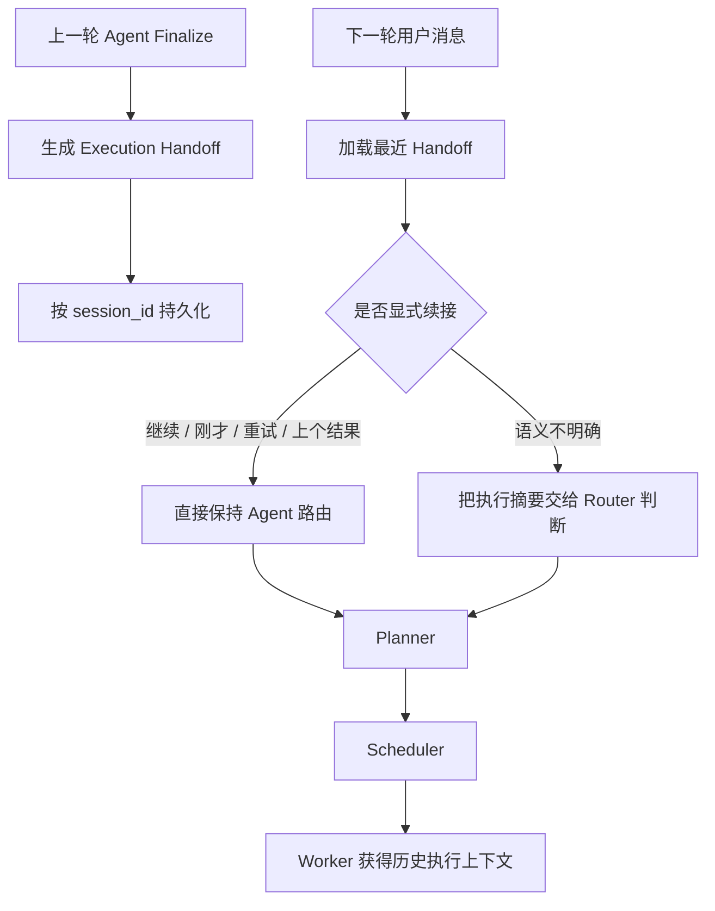

# LightMe Agent 跨轮记忆与过程可视化改造说明

## 1. 问题结论

用户观察到的“Agent 下一轮变笨”是真实问题，不只是前端错觉。

改造前虽然保存了完整 Trace，但存在一条断开的链路：

```text
上一轮 Agent Trace 已保存
        ↓
下一轮先进入 Router
        ↓
Router 只看到普通聊天历史
        ↓
“继续、按刚才结果改、给我绝对路径”等短指令可能被路由到 Chat
        ↓
没有进入 Agent 主图，也就没有读取上一轮 Trace
```

因此，问题不是完全没有保存，而是“保存了，但下一轮可能没有进入读取它的路径”。

截图中的可读性问题也很明确：过程面板大量使用 8px、9px 字号，节点列只有 72px，弱对比文字在缩放或低分辨率截图中会明显发虚，`Research Worker` 等名称还会被截断。

## 2. 本次改造目标

1. 让同一 Session 的 Agent 执行结果能够跨轮续接。
2. 让 Router 在明确追问时保持 Agent 路由，不退化成普通 Chat。
3. 让 Planner 和 Worker 获得上一轮的关键决策、证据、产物和未完成项。
4. 重新打开会话后，在聊天页面恢复最近一次 Agent 执行 Trace。
5. 提升过程面板字号、对比度、列宽和信息层级。

## 3. 为什么不保存逐字“内心推理”

系统不会保存或展示模型不可审计的逐字隐性思维链。原因是：

- 隐性推理可能包含猜测、自我修正和无依据文本，不能当作事实。
- 长推理会显著增加数据库体积和下一轮 Token 消耗。
- 外部工具内容可能包含 Prompt Injection，不应整段传播到后续任务。
- 企业级系统更需要“可验证决策记录”，而不是模型自述的思考独白。

本项目保存的是结构化、可审计的执行推理：

- 用户目标；
- 计划版本和子任务 DAG；
- Worker 选择；
- 实际工具调用；
- 工具 Observation 摘要；
- 证据来源；
- 验收状态和问题；
- 生成产物；
- 重试、重规划和停止原因；
- 最终结果与未完成项。

这些信息足够让下一轮继续工作，同时可以通过 Trace 复核。

## 4. 改造后的跨轮链路



## 5. Execution Handoff 数据

每次 Agent Finalize 后保存一份有界的执行交接胶囊，主要包括：

```text
run_id
session_id
goal
status
plan_id / plan_version
complexity
final_summary
stop_reason
scheduler_epochs
replan_count
subtasks[]
artifacts[]
open_items[]
created_at
```

每个子任务保存：

```text
id / desc / status / worker / depends_on
result / error
tool_calls[]
evidence[]
evidence_sources[]
artifacts[]
verification.status
verification.issues[]
verification.passed_checks[]
```

工具参数在进入 Handoff 前已经经过敏感字段脱敏；上下文还设置了长度上限，防止无限增长。

## 6. Router 连续性策略

### 6.1 确定性续接

当同一 Session 存在最近 Agent 执行，并且用户消息包含以下引用时，Router 直接返回 `agent`，不再调用模型猜测：

- 继续、接着、下一步；
- 刚才、上次、按上面、按刚才；
- 基于之前、在此基础上；
- 重试、再试一次、重新执行；
- 用上一个文件、刚才的结果、前面的结果。

### 6.2 语义续接

对于“给我绝对路径”这类没有显式说“刚才”、但明显可能引用上一轮结果的短指令，Router Prompt 会获得最近执行摘要，再由模型结合会话历史判断是否继续走 Agent。

### 6.3 Session 边界

- Handoff 严格按 `session_id` 查询。
- 新会话不会读取旧会话的执行记录。
- 删除会话时同步删除 Run、Plan、Trace 和 Handoff。

## 7. Planner 与 Worker 如何复用

Planner 获得：

- 清理时间戳后的最近对话；
- 最近两次 Agent Handoff；
- 长期/情景记忆；
- 用户最新指令。

Worker 获得：

- 当前结构化子任务；
- 声明的依赖任务结果；
- 最近执行交接摘要；
- 相关长期记忆；
- 当前 Worker 与子任务工具白名单。

旧实现把数据库时间戳直接拼进 Prompt，导致计划中出现：

```text
上下文: [用户]: [2026-07-28 ...]
```

现在时间戳只保留在数据库展示层，进入模型前会被移除。简单计划的 `desc` 也只保留当前指令，不再把整段聊天历史塞进任务标题。

## 8. 前端恢复机制

重新打开或切换到一个已有会话时，前端会：

1. 加载普通聊天消息；
2. 查询该 Session 最近的 Agent Run；
3. 加载完整 Plan 和 Trace；
4. 在聊天底部恢复最近一次执行面板；
5. 标记为 `SESSION MEMORY`；
6. 保留“查看完整执行拓扑”入口。

下一轮 Agent 真正读取上一轮交接时，时间线会显示：

```text
继承上一轮执行上下文
保存执行交接记忆
```

这样用户可以看见系统确实发生了“读取”和“保存”，而不是只在后台声称自己有记忆。

## 9. 可读性调整

| 元素 | 改造前 | 改造后 |
|---|---:|---:|
| 面板最大宽度 | 760px | 940px |
| 标题 | 11px | 14px |
| 标题辅助信息 | 9px | 11px |
| Plan 目标 | 10px | 13px |
| 子任务正文 | 9px | 12px |
| Worker 节点名 | 8px / 72px 列 | 10.5px / 116px 列 |
| 事件标题 | 9px | 12.5px |
| 事件详情 | 8px | 11.5px |
| 时间 | 8px | 10px |
| 展开高度 | 560px | 720px |

同时取消关键内容的单行省略，让事件详情和长 Worker 名称可以正常换行，并提高文字颜色对比度。

## 10. 关键实现文件

| 文件 | 改造内容 |
|---|---|
| `app/agent/runtime.py` | Handoff Schema、Session 存储、格式化、续接识别 |
| `app/agent/agent_graph.py` | Planner 加载历史执行、Worker 注入、Finalize 保存交接 |
| `app/agent/workers.py` | 扩大有界执行记忆上下文 |
| `app/llm/llm_chain.py` | Router 续接、时间戳清理、加载 Session 执行上下文 |
| `web/js/index.js` | 恢复最近 Agent Trace、显示继承/保存事件 |
| `web/js/terminal.js` | Trace 控制台增加续接记忆事件 |
| `web/css/workbench.css` | 过程面板字号、列宽、对比度和高度优化 |

## 11. 当前边界

- 聊天内默认恢复最近一次完整 Agent Trace；更早的运行可在工作流页面查看。
- Handoff 是摘要，不会无限保存完整工具输出。
- 当前跨轮恢复发生在任务边界；服务运行中途崩溃后的断点续跑仍需要持久化 checkpoint。
- “语义续接”仍可能被 Router 模型误判，明确引用会走确定性规则。
- 长期跨 Session 的用户偏好仍属于 Agent Memory，不与本次 Session Handoff 混用。

这次改造解决的是“上一轮已经做过什么，下一轮是否知道并能继续”的问题。下一阶段如果继续提高能力，应优先实现运行中断恢复、Handoff 相关性排序，以及任务级连续性评测集。
