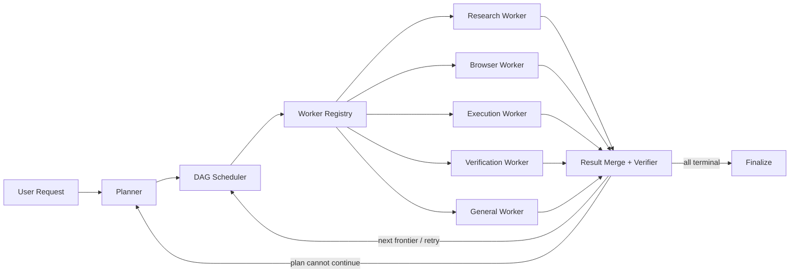
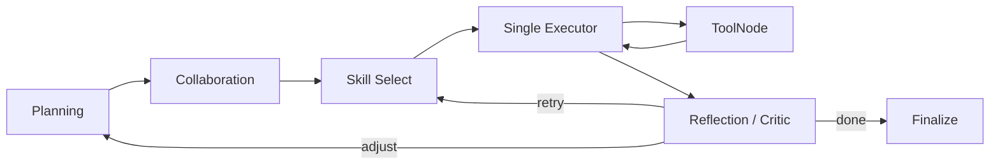
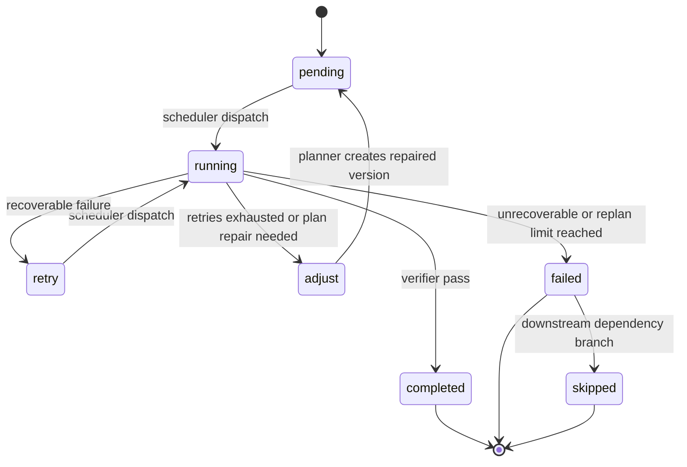

# LightMe Planner-Scheduler-Worker 多智能体架构改造说明

> 本文基于项目改造前代码、当前实现，以及《红岩网校.md》中“可靠 AI Agent 系统开发”与“Planner-Executor 与任务规划”的要求编写。

## 1. 改造结论

改造前的 LightMe 已经具备计划生成、工具调用、结果评审、运行预算和 Trace 等 Agent Runtime 基础，但所谓“多智能体协作”主要依靠同一个模型切换角色提示词。Researcher、Executor、Critic 并没有形成独立执行上下文、能力边界和结构化通信协议，也没有真正并行执行无依赖子任务。

改造后，主执行图变为：



这次改造的核心不是增加更多角色名称，而是让多智能体具备四个真实特征：

1. 独立上下文：每个 Worker 只看到当前子任务、依赖结果、相关记忆和允许工具。
2. 独立能力边界：Worker Registry 根据任务类型和 Skill 选择不同工具白名单。
3. 结构化通信：调度输入为 `WorkerTask`，执行输出为 `WorkerResult`，不再靠自然语言日志传递控制状态。
4. 真实调度：Scheduler 根据 DAG 前沿并行低风险只读任务，串行执行写入、高风险和可能产生副作用的任务。

## 2. 改造前架构

### 2.1 主流程



### 2.2 原有优点

- 已有结构化计划字段：子任务 ID、依赖、预期结果、风险、验收条件、工具范围和调用预算。
- 已有计划合法性检查、能力修复、计划评分、动态 DAG 快照和计划版本保存。
- 已有最大步骤、运行时间、Token、工具次数和重复调用保护。
- 工具层已经包含危险命令检查、审批和文件操作保护。
- 已有 SQLite + JSONL Trace，并能在前端显示计划与执行过程。
- 已有重试、Verifier 和局部重规划入口，不是简单的一次模型调用。

### 2.3 原有主要问题

| 问题 | 原实现表现 | 影响 |
|---|---|---|
| 多智能体是提示词角色扮演 | Researcher、Critic 复用同一个 `chat_model`，主要差异是 System Prompt | 角色数量增加，但执行能力没有真正分离 |
| Researcher 没有真实工具循环 | 协作节点调用模型后直接收集文本，没有绑定检索工具 | “研究结果”可能只是模型已有知识或猜测 |
| Executor 委派只是日志 | Collaboration 中记录“委派 Executor”，实际仍进入单一 Executor 节点 | 没有独立 Worker 生命周期和调度记录 |
| 所有子任务串行 | 通过 `current_subtask` 逐个推进 | 无依赖任务也不能并行，复杂任务耗时较高 |
| 控制信息依赖自然语言 | `collaboration_log` 和消息文本承担部分协作信息 | 难以校验、统计、恢复和自动评测 |
| 全局工作记忆污染 | `agent_memory.working` 被所有运行共享，并存放当前任务、计划和阶段结果 | 并发 Session 可能互相覆盖上下文 |
| 重规划可能读取错消息 | 图回到 Planning 时，最后一条消息可能是内部 Plan/Review 消息 | Planner 可能把内部消息误当成用户目标 |
| Trace 不适合并发写 | SQLite 和 JSONL 写入没有进程内互斥 | 多 Worker 同时记录事件时可能锁冲突或交错 |
| 前端展示旧流程 | 固定展示 Skill Select、Executor、Reflection | 无法表达批次、并行 Worker、证据和归并 |

## 3. 改造后架构

### 3.1 Planner

Planner 仍负责复杂度判断和结构化计划生成，保留项目已有的强项：

- 生成唯一子任务 ID、目标、预期结果和依赖关系。
- 为每个子任务声明 `task_type`、`risk_level`、`acceptance_checks`、`allowed_tools` 和 `max_tool_calls`。
- 对 Planner JSON 做解析容错、Schema 归一化、循环依赖检查和计划质量评分。
- 根据当前 Skill 能力修复不可执行计划。
- 计划失败时尽量保留已完成子任务，只调整失败分支。

本次新增每次运行独立的 `run_context`。重规划时使用原始用户目标和历史上下文，不再从最后一条内部消息反推任务。

### 3.2 Scheduler

Scheduler 是改造后的控制核心，职责包括：

1. 读取动态 DAG 的 ready frontier。
2. 根据并行度、任务类型和风险选择本批次。
3. 把被派发任务标为 `running`，防止重复调度。
4. 通过 Worker Registry 选择执行者。
5. 执行一个或多个 Worker，并归并 `WorkerResult`。
6. 根据确定性 Verifier 将任务更新为 `completed`、`retry`、`adjust` 或 `failed`。
7. 对失败依赖的下游任务标记 `skipped`，避免计划无声卡死。
8. 根据状态进入下一批次、局部重规划或最终汇总。

调度控制完全由结构化状态决定，不让模型自然语言直接决定图路由。

### 3.3 Worker Registry

当前注册五类 Worker：

| Worker | 主要任务 | 能力边界 |
|---|---|---|
| `research_worker` | research、read、analyze | 搜索、抓取、读取和系统观察类工具 |
| `browser_worker` | browse | 浏览器、网页交互、截图类工具 |
| `execution_worker` | execute、write、create | Python、Shell、文件和系统操作工具 |
| `verification_worker` | verify | 读取、测试、检查和系统观察工具 |
| `general_worker` | general | 默认无工具，负责直接回答或综合 |

选择依据不是角色提示词，而是 `task_type + skill + worker capability`。最终可用工具还要经过子任务 `allowed_tools` 与 Worker 白名单的交集，因此 Planner 即使误列了工具，也不能越过 Worker 的能力边界。

### 3.4 Worker 独立执行循环

每个 Worker 使用独立消息列表运行：

```text
System: Worker 职责 + 子任务契约 + 工具边界
Human: 当前子任务目标
Assistant: 发起工具调用
Tool: 真实 Observation
Assistant: 基于证据生成子任务结论
```

Worker 不接收父图完整消息历史，只接收：

- 当前子任务目标和预期结果；
- 验收条件、风险和调用预算；
- 当前任务允许的工具；
- 已声明依赖任务的结果；
- 截断后的相关长期记忆。

这种上下文最小化能降低 Token 消耗、跨任务干扰和工具输出注入的传播范围。

### 3.5 结构化协议

`WorkerTask` 主要字段：

```text
run_id, session_id, subtask_id, objective, expected_result,
task_type, risk_level, acceptance_checks, allowed_tools,
max_tool_calls, skill, dependency_results, memory_context, deadline_seconds
```

`WorkerResult` 主要字段：

```text
run_id, subtask_id, worker, status, summary,
evidence[], artifacts[], tool_calls[], verification,
token_count, step_count, elapsed_seconds, error
```

其中 `evidence` 保存工具来源和观察摘要，`artifacts` 保存文件、目录或截图 URI。最终汇总层直接消费这些结构化字段，不需要解析 Worker 的角色对话日志。

## 4. 调度、并行与失败恢复

### 4.1 安全并行规则

- 同一 DAG 前沿中，`read/research/analyze/browse/general/verify` 等低风险任务可以并行。
- `write/create/execute` 或 `risk_level=high` 的任务一次只派发一个。
- 并行上限来自 `planner_parallelism` 配置。
- 当前实现使用进程内 `ThreadPoolExecutor`，适合 I/O 密集的模型与工具调用。
- 所有 Worker 结束后由 Scheduler 单线程归并状态，避免多个 Worker 同时修改计划。

### 4.2 状态机



### 4.3 重试与重规划

- 单子任务最多重试 3 次。
- 工具策略违规直接要求重规划，而不是扩大权限继续尝试。
- 可恢复失败先进入 `retry`。
- 重试耗尽或 Verifier 判定计划不可继续时进入 `adjust`。
- 全局最多局部重规划 2 次，超过后任务失败，防止无限 Planner 循环。
- 已完成子任务在重规划后按 ID 恢复结果，避免无意义重复执行。

## 5. 会话隔离、记忆与 Trace

### 5.1 会话隔离

改造前的 `agent_memory.working` 是进程级共享字典。新主图不再用它保存当前任务、计划、研究结果或当前 Skill，而是在 `AgentState` 中保存：

- `run_context`
- `task_results`
- `artifacts`
- `dispatch_batch`
- `scheduler_epoch`
- `replan_count`

长期记忆仍由 `AgentMemory` 提供，但检索时使用 `include_working=False`，避免其他运行的临时数据进入当前 Worker。

### 5.2 跨轮执行交接

每次 Agent 完成后会把可审计执行状态保存为 Session 级交接胶囊，包括目标、子任务状态、Worker 结果、工具调用、Observation 摘要、Verifier 结论、产物和未完成项。下一轮 Router 会读取该上下文；当用户说“继续”“按刚才结果修改”“重试”或引用上一个文件时，直接保持 Agent 路由，Planner 和 Worker 也会收到同一份有界上下文。

交接胶囊不保存模型不可验证的逐字隐性推理。用户删除会话时，对应运行、计划、事件、交接记录和 JSONL Trace 会一起删除。

### 5.3 可审计 Trace

新增关键事件：

- `scheduler_batch_created`
- `worker_dispatched`
- `worker_started`
- `worker_tool_policy`
- `worker_tool_call_requested`
- `worker_tool_result`
- `artifact_created`
- `worker_completed`
- `scheduler_batch_completed`
- `scheduler_blocked`
- `scheduler_stopped`
- `session_context_hydrated`
- `run_handoff_saved`

TraceStore 增加进程内写锁和 SQLite 等待超时，允许并行 Worker 安全记录 SQLite 与 JSONL 事件。

前端只展示可审计过程，例如计划、派发、工具、证据、产物、验收和重规划，不展示模型私密逐字推理。这样既能让用户看到 Agent 如何工作，也不会把不可验证的思维文本误当成事实证据。

## 6. 改造前后对比

| 维度 | 改造前 | 改造后 |
|---|---|---|
| 主图 | Planning → Collaboration → 单 Executor → Reflection | Planning → Scheduler → Worker Batch → Merge/Verify |
| 多智能体真实性 | 同一模型切换角色 Prompt | 独立 Worker 实例、消息、工具和结果协议 |
| 子任务通信 | 自然语言消息和 `collaboration_log` | `WorkerTask` / `WorkerResult` |
| 工具执行 | 主要由单 Executor 绑定工具 | 每个 Worker 真实绑定最小工具集合 |
| 并行 | 无 | 同一 DAG 前沿安全并行 |
| 写操作冲突 | 没有调度层统一限制 | 写入、执行和高风险任务串行 |
| 依赖输入 | Executor 可看到父图较多消息 | 只注入声明的依赖结果 |
| 结果证据 | 主要是文本 | 结论 + evidence + artifacts + verification |
| 验收 | Reflection 模型评审 + 部分确定性检查 | 每个 Worker 结束即确定性验收，Scheduler 归并 |
| 重规划目标 | 可能受最后一条内部消息影响 | 固定使用隔离 `run_context` 原始目标 |
| Session 临时状态 | 全局 `working` 字典 | 每次运行的 AgentState |
| 跨轮连续性 | 主要依赖最终回答和短聊天历史 | Session 级执行交接，Router、Planner、Worker 共同复用 |
| Trace 并发安全 | 不保证 | 进程内串行写 SQLite + JSONL |
| 前端 | 固定旧节点时间线 | 展示批次、Worker、工具、证据、产物和验收 |

## 7. 两种架构的优劣

### 7.1 改造前架构

优点：代码路径直观；模型调用较少；调试单步任务容易；对简单聊天延迟较低。

缺点：协作缺乏真实能力隔离；复杂任务不能并行；角色文本难以自动校验；全局临时记忆不适合并发；失败恢复依赖较长的对话状态。

### 7.2 改造后架构

优点：

- Planner、Scheduler、Worker 职责明确，路由可解释。
- 无依赖 I/O 任务可以真实并行，提高复杂任务吞吐。
- Worker 上下文更小，减少无关信息和跨任务污染。
- 工具采用双重白名单，权限范围比单 Executor 更细。
- 结果、证据、产物和验收均可结构化保存，便于回放与评测。
- 失败可以局部重试或重规划，不必重新执行整条计划。

代价：

- 模型调用次数可能增加，简单任务需要依靠复杂度判断控制开销。
- 并发模型调用会提高瞬时配额压力。
- 结构化状态和 Trace 更多，存储与调试复杂度上升。
- 本地线程池不是分布式任务队列，进程退出后正在运行的 Worker 不能恢复。
- Worker 虽然上下文隔离，但当前默认仍共享同一个底层模型配置。

## 8. 与《红岩网校.md》要求的对应关系

| 要求 | 当前状态 | 说明 |
|---|---|---|
| 多轮模型、工具、Observation Agent Loop | 已实现 | Worker 内部真实工具循环 |
| 最大步骤、时间、Token、工具预算 | 已实现 | RuntimeBudget + Worker 调用上限 |
| 非法工具、工具异常、格式错误处理 | 已实现 | 工具白名单、异常结果、Planner JSON 容错 |
| Session 状态隔离 | 已改进 | 主执行临时状态迁移到 AgentState |
| 跨轮执行记忆 | 已实现 | 保存工具、Observation、验收、产物和未完成项，不保存隐性逐字推理 |
| 完整运行 Trace | 已实现 | 计划版本、调度、Worker、工具、验收和结果 |
| 重复工具调用检测 | 已实现 | Worker 调用签名防循环 |
| 结构化子任务和唯一标识 | 已实现 | normalize_plan + WorkerTask |
| 依赖建模与动态 DAG | 已实现 | ready frontier + state_graph |
| 无依赖任务并行 | 已实现 | 风险感知批次 + ThreadPoolExecutor |
| 子任务失败重试 | 已实现 | retry_count + MAX_SUBTASK_RETRIES |
| 局部重规划 | 已实现 | adjust → Planner，并保留已完成任务 |
| 计划质量评分与能力修复 | 已实现 | score + capability repair |
| 结果自动验证 | 已实现 | deterministic verifier |
| 计划版本对比和回滚 | 部分实现 | 已保存版本，尚无真正状态回滚 |
| 中断后恢复 | 未实现 | 缺少持久化 checkpoint 和 Worker 租约 |
| 20 个自动评测任务 | 未完成 | 当前 35 项是单元测试，不等同于任务级评测集 |
| 与简单 Agent Loop 对照实验 | 未完成 | 需要补基线、指标采集和实验报告 |
| 完整 Sandbox 资源隔离 | 部分实现 | 已有危险命令与审批，但无容器级 CPU/内存/网络隔离 |

## 9. 实现文件

| 文件 | 作用 |
|---|---|
| `app/agent/workers.py` | Worker 协议、注册表、工具边界、独立执行循环和批次执行器 |
| `app/agent/agent_graph.py` | Planner-Scheduler-Worker 主图、结果归并、重试、重规划和最终输出 |
| `app/agent/runtime.py` | 运行状态、DAG、Verifier、预算和并发安全 Trace |
| `app/llm/llm_chain.py` | 续接识别、历史时间戳清理和 Agent Router 上下文注入 |
| `app/agent/memory.py` | 支持排除全局 working memory 的检索方式 |
| `app/agent/agent.py` | 新 Worker API 的兼容导出 |
| `web/js/index.js` | 聊天内实时调度、Worker 时间线和历史 Trace 恢复 |
| `web/js/terminal.js` | Trace 控制台的 Worker 审计事件与 DAG 状态 |
| `web/js/workflow.js` | Planner-Scheduler-Worker 工作流拓扑 |
| `tests/test_agent_workers.py` | Worker、调度、隔离和并发 Trace 回归测试 |

旧的 `collaboration_node`、`skill_select_node`、`executor_node` 和 `reflection_node` 仍保留导出，供旧代码兼容，但已经不在新 `agent_workflow` 主执行图中。

## 10. 验证结果

当前使用项目虚拟环境执行：

```powershell
.\.venv\Scripts\python.exe -m unittest discover -s tests -v
```

共 41 项测试通过。新增测试覆盖：

- Worker Registry 能力选择；
- 安全并行批次选择；
- Worker 真实工具调用循环；
- 依赖结果最小化注入；
- `running` 状态防重复派发；
- 并行 Worker Trace 写入。
- Scheduler 批次归并和 Finalize 路由。
- 执行交接中的工具、Observation 与验收信息保留；
- 交接记忆的 Session 隔离和删除清理；
- 显式续接请求识别。

## 11. 当前边界与下一步

本次改造已经让项目从“提示词角色扮演式多 Agent”升级为“结构化协议 + DAG 调度 + 独立 Worker + 证据验收”的本地多智能体 Runtime，但距离完整生产级系统仍有以下差距：

1. 持久化调度：把线程池升级为带租约、心跳、幂等键和 checkpoint 的任务队列。
2. 真正 Sandbox：为 Shell/Python Worker 使用容器或受限进程，限制 CPU、内存、进程、目录和网络。
3. 任务级评测：建立至少 20 个复杂任务，比较简单 Loop、旧 Planner-Executor 和新架构的成功率、步骤、耗时、Token、工具次数与恢复率。
4. 模型路由：Planner、Worker、Verifier 可配置不同模型，并根据成本、延迟和任务难度动态选择。
5. 产物事务：写操作增加临时工作区、变更预览、提交/回滚和幂等保护。
6. 注入防护：区分可信指令、用户内容和外部工具内容，对网页或文件中的恶意指令做隔离测试。
7. 可恢复运行：持久化 AgentState，在服务重启后从最后一个已完成批次恢复。
8. 计划版本 UI：增加版本 Diff、失败分支高亮和人工选择回滚点。

其中，最适合作为红岩网校考核“实质性创新 + 对照实验”的下一步，是先完成第 3 项：固定任务集和指标后，才能用数据证明安全并行、局部重规划和 Worker 隔离确实优于简单 Agent Loop。
